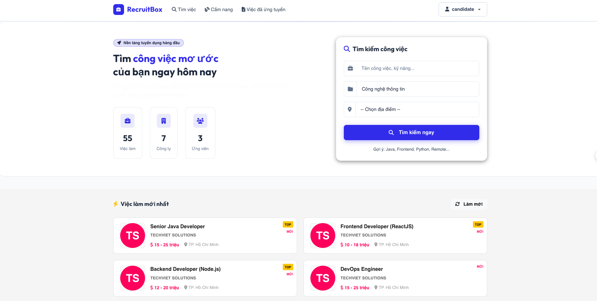
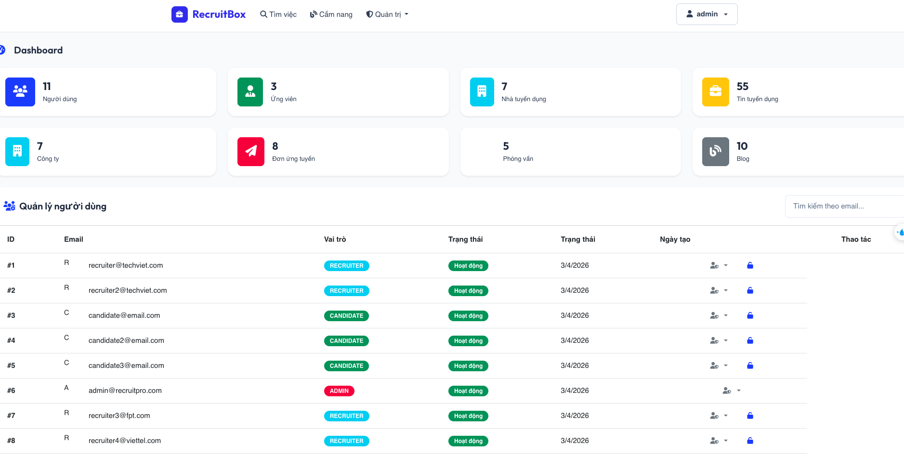
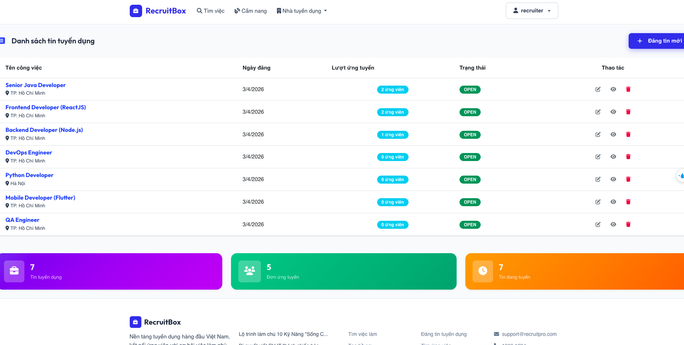
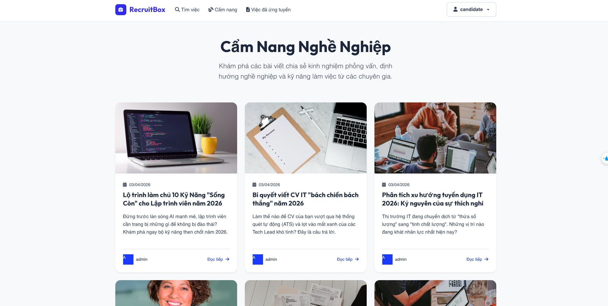

# RecruitBox - Hệ thống Tuyển dụng Việc làm

<!-- Header & Badges -->


---

## 1. About The Project

**RecruitBox** là một nền tảng tuyển dụng trực tuyến được xây dựng bằng Spring Boot, giúp kết nối nhà tuyển dụng với ứng viên một cách hiệu quả. Hệ thống hỗ trợ quản lý tin tuyển dụng, theo dõi đơn ứng tuyển qua Pipeline Kanban, lên lịch phỏng vấn và giao tiếp giữa các bên.

---

## 2. Key Features

### Cho Ứng viên
- Đăng ký / Đăng nhập (Email)
- Tạo và quản lý hồ sơ ứng viên (kỹ năng, kinh nghiệm)
- Tải lên CV cá nhân
- Tìm kiếm việc làm theo ngành nghề và từ khóa
- Ứng tuyển trực tiếp và theo dõi trạng thái đơn
- Lưu tin tuyển dụng yêu thích
- Đặt thông báo việc làm theo từ khóa (Job Alerts)
- Nhắn tin trực tiếp với nhà tuyển dụng
- Làm form trắc nghiệm MBTI

### Cho Nhà tuyển dụng
- Đăng ký và xác thực công ty (phê duyệt bởi Admin)
- Đăng tin tuyển dụng với đầy đủ thông tin
- Pipeline Kanban quản lý ứng viên (Kéo-thả)
- Lên lịch phỏng vấn và quản lý lịch hẹn
- Chốt Offer / Từ chối ứng viên
- Xem chi tiết hồ sơ ứng viên
- Nhắn tin với ứng viên

### Cho Quản trị viên
- Dashboard thống kê tổng quan
- Quản lý danh sách công ty (phê duyệt/từ chối)
- Quản lý tin tuyển dụng
- Quản lý blog cẩm nang nghề nghiệp
- Quản lý người dùng

---

## 3. Tech Stack

### Backend
| Technology | Version | Purpose |
|------------|---------|---------|
| Java | 21 | Programming Language |
| Spring Boot | 3.5.12 | Backend Framework |
| Spring Security | 6.x | Authentication & Authorization |
| Spring Data JPA | 3.x | ORM / Data Access |
| JWT (jjwt) | 0.12.6 | Token-based Authentication |
| Lombok | - | Boilerplate Code Reduction |
| Lombok | - | Boilerplate Code Reduction |

### Frontend
| Technology | Version | Purpose |
|------------|---------|---------|
| Thymeleaf | 3.x | Server-side Rendering (SSR) |
| Bootstrap | 5.3 | UI Framework |
| Font Awesome | 6.4 | Icon Library |
| JavaScript (ES6+) | - | Client-side Logic |

### Database & Tools
| Technology | Version | Purpose |
|------------|---------|---------|
| MySQL | 8.0 | Relational Database |
| Maven | 3.8+ | Build Tool |
| Hibernate | 6.x | ORM Implementation |

---

## 4. Getting Started

### Prerequisites

Đảm bảo bạn đã cài đặt các phần mềm sau trên máy:

- **Java Development Kit (JDK)** phiên bản 21 trở lên
  ```bash
  java -version  # Kiểm tra phiên bản Java
  ```

- **Apache Maven** phiên bản 3.8 trở lên
  ```bash
  mvn -version  # Kiểm tra phiên bản Maven
  ```

- **MySQL** phiên bản 8.0 trở lên
  ```bash
  mysql --version  # Kiểm tra phiên bản MySQL
  ```

### Installation

**1. Clone Repository**

```bash
git clone <repository-url>
cd RecruitBox
```

**2. Tạo Database**

Đăng nhập vào MySQL và tạo database:

```bash
mysql -u root -p
```

```sql
CREATE DATABASE recruitment_db CHARACTER SET utf8mb4 COLLATE utf8mb4_unicode_ci;
EXIT;
```

**3. Cấu hình Environment Variables**

Tạo file `.env` trong thư mục gốc của project (hoặc export trực tiếp):

```bash
# Database Password
export DB_PASSWORD=your_mysql_password

# JWT Secret (chuỗi bảo mật ngẫu nhiên cho JWT)
export JWT_SECRET=your_jwt_secret_key_min_32_chars

# Google OAuth2 Credentials (tùy chọn - để đăng nhập bằng Google)
export GOOGLE_CLIENT_ID=your_google_client_id
export GOOGLE_CLIENT_SECRET=your_google_client_secret
```

**4. Chạy Ứng dụng**

```bash
# Development mode với Maven
./mvnw spring-boot:run

# Hoặc đóng gói JAR và chạy
./mvnw clean package
java -jar target/j2pp-0.0.1-SNAPSHOT.jar
```

**5. Truy cập Ứng dụng**

Mở trình duyệt và truy cập: http://localhost:8080

---

## 5. Environment Variables

| Variable | Description | Required | Default |
|----------|-------------|----------|---------|
| `DB_PASSWORD` | Mật khẩu MySQL | Yes | - |
| `JWT_SECRET` | Secret key cho JWT token (tối thiểu 32 ký tự) | Yes | - |
| `GOOGLE_CLIENT_ID` | OAuth2 Client ID từ Google Cloud Console | No | - |
| `GOOGLE_CLIENT_SECRET` | OAuth2 Client Secret từ Google Cloud Console | No | - |
| `MAIL_USERNAME` | Email SMTP để gửi mail thông báo | No | - |
| `MAIL_PASSWORD` | App Password của email SMTP | No | - |

### Cách lấy Google OAuth2 Credentials

1. Truy cập [Google Cloud Console](https://console.cloud.google.com/)
2. Tạo Project mới hoặc chọn Project hiện tại
3. Điều hướng đến **APIs & Services** → **Credentials**
4. Click **Create Credentials** → **OAuth client ID**
5. Application type: **Web application**
6. Thêm Authorized redirect URI: `http://localhost:8080/login/oauth2/code/google`
7. Copy **Client ID** và **Client Secret** vào environment variables

---

## 6. Folder Structure

```
RecruitBox/
├── src/
│   └── main/
│       ├── java/duanspringboot/
│       │   ├── J2ppApplication.java          # Entry point
│       │   ├── config/                        # Configuration classes
│       │   │   ├── SecurityConfig.java        # Spring Security setup
│       │   │   ├── GlobalModelAdvice.java     # Global Thymeleaf model
│       │   │   └── OAuth2ClientConfig.java   # OAuth2 client setup
│       │   ├── controller/                   # REST & View Controllers
│       │   │   ├── ViewController.java        # HTML View routing
│       │   │   ├── AuthController.java        # Authentication APIs
│       │   │   ├── JobPostingController.java  # Job management APIs
│       │   │   ├── ApplicationController.java  # Application APIs
│       │   │   ├── InterviewController.java   # Interview APIs
│       │   │   └── AdminController.java       # Admin APIs
│       │   ├── dto/                          # Data Transfer Objects
│       │   │   ├── auth/                     # Login, Register DTOs
│       │   │   ├── job/                      # Job-related DTOs
│       │   │   ├── Application/              # Application DTOs
│       │   │   └── ...
│       │   ├── entity/                       # JPA Entities (Database tables)
│       │   │   ├── User.java
│       │   │   ├── Company.java
│       │   │   ├── JobPosting.java
│       │   │   ├── Application.java
│       │   │   ├── Interview.java
│       │   │   └── ...
│       │   ├── enums/                        # Enumerations
│       │   │   ├── Role.java                  # CANDIDATE, RECRUITER, ADMIN
│       │   │   ├── JobStatus.java             # DRAFT, ACTIVE, CLOSED
│       │   │   ├── ApplicationStatus.java     # APPLIED, SHORTLISTED...
│       │   │   └── ApprovalStatus.java        # PENDING, APPROVED, REJECTED
│       │   ├── repository/                   # Spring Data JPA Repositories
│       │   ├── security/                     # Security components
│       │   │   ├── JwtFilter.java            # JWT authentication filter
│       │   │   └── CustomUserDetails.java    # User details implementation
│       │   └── service/                      # Business logic layer
│       └── resources/
│           ├── application.properties          # Main configuration
│           ├── static/                        # CSS, JS, images
│           │   ├── css/
│           │   │   ├── main.css
│           │   │   ├── auth.css
│           │   │   └── dashboard.css
│           │   ├── js/
│           │   │   ├── main.js
│           │   │   ├── auth.js
│           │   │   └── pipeline.js
│           │   └── uploads/                  # User uploaded files
│           └── templates/                     # Thymeleaf HTML templates
│               ├── layout/
│               │   └── main-layout.html       # Base layout (navbar, footer)
│               ├── auth/
│               │   ├── login.html
│               │   └── register.html
│               ├── common/
│               │   ├── index.html             # Homepage
│               │   ├── job-detail.html
│               │   ├── jobs-by-field.html
│               │   ├── blogs.html
│               │   └── blog-detail.html
│               ├── candidate/                  # Candidate pages
│               ├── recruiter/                 # Recruiter pages
│               │   ├── jobs/
│               │   ├── applications/
│               │   │   └── pipeline.html       # Kanban Pipeline
│               │   └── interviews/
│               └── admin/                     # Admin pages
├── .env                                    # Environment variables (not committed)
├── .gitignore
├── pom.xml                                 # Maven dependencies
└── README.md
```

---

## 7. Usage / Demo

### Đăng ký và Đăng nhập

1. **Ứng viên**: Truy cập `/register`, chọn vai trò "Ứng viên", điền thông tin và bắt đầu tìm việc
2. **Nhà tuyển dụng**: Truy cập `/register`, chọn vai trò "Nhà tuyển dụng", điền thông tin công ty. Tài khoản sẽ được Admin phê duyệt trước khi sử dụng.

### Sample Accounts (Password Login)

| Email | Password | Role | Status |
|-------|----------|------|--------|
| recruiter@techviet.com | password123 | RECRUITER | Approved |
| candidate@email.com | password123 | CANDIDATE | Active |
| admin@recruitpro.com | password123 | ADMIN | Active |

> **Note**: Sample accounts sử dụng đăng nhập bằng mật khẩu. Google Login cần cấu hình OAuth2 credentials.

### Demo Screenshots

#### 1. Trang chủ

*Hình 1: Trang chủ RecruitBox với danh sách việc làm nổi bật*

#### 2. Dashboard Admin

*Hình 2: Dashboard quản trị với thống kê hệ thống*

#### 3. Dashboard Nhà tuyển dụng

*Hình 3: Dashboard nhà tuyển dụng với quản lý tin tuyển dụng*

#### 4. Pipeline Nhà tuyển dụng

*Hình 4: Pipeline nhà tuyển dụng *

#### 5. Cẩm nang nghề nghiệp

*Hình 5: Các blog mà admin đăng *
---

## 8. License & Contact

### License

Dự án này được phân phối dưới giấy phép **MIT License**. Xem file `LICENSE` để biết thêm chi tiết.

---


